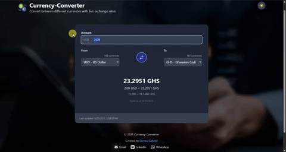
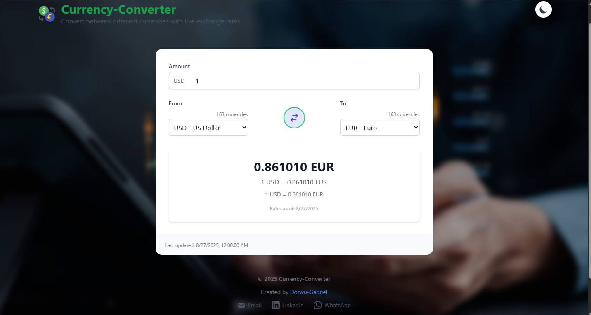
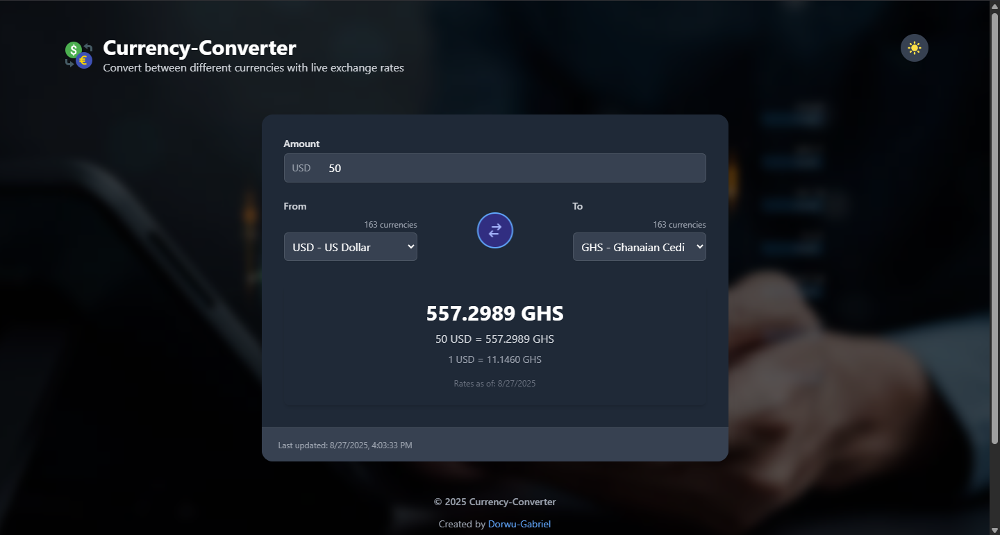

**Project Name:** Currency Converter App  
**Author:** Dorwu Gabriel  
**Date:** August 2025

<div class="flex items-center space-x-2">  <h1 class="text-2xl font-bold">CURRENCY CONVERTER APP</h1> </div>

  A responsive web application that enables users to convert between various currencies in real-time using live exchange rate data from a public API.
  Built with React, Zustand for state management, and Tailwind CSS for styling. Deployed on Vercel.


---

## Demo

### Live Demo
[](https://currency-converter-app-57lk.vercel.app/)

### App in Action


## Screenshots

### Light Theme


### Dark Theme


## Project Overview
The Currency Converter App allows users to:
- Select source and target currencies from a comprehensive list
- Enter any amount for conversion
- View real-time converted results
- Toggle between light and dark themes
- View conversion history
- Access the app on any device

## Tech Stack
- **Frontend:** React
- **State Management:** Zustand
- **Styling:** Tailwind CSS
- **API:** ExchangeRate-API
- **Deployment:** Vercel

## Features
- Real-time currency conversion
- Swap currencies with a single click
- Dark/Light mode toggle
- Responsive design for all devices
- Clean and intuitive user interface
- Quick access to popular currency pairs

## Getting Started

### Prerequisites
- Node.js (v14 or later)
- npm or yarn

### Installation
1. Clone the repository
   ```bash
   git clone https://github.com/yourusername/currency-converter-app.git
   cd currency-converter-app
   ```
2. Install dependencies
   ```bash
   npm install
   # or
   yarn install
   ```
3. Create a `.env` file in the root directory and add your API key:
   ```
   VITE_EXCHANGE_RATE_API_KEY=your_api_key_here
   ```
4. Start the development server
   ```bash
   npm run dev
   # or
   yarn dev
   ```

## License
This project is licensed under the MIT License - see the [LICENSE](LICENSE) file for details.

## Acknowledgments
- [ExchangeRate-API](https://www.exchangerate-api.com/) for the currency data
- [React Icons](https://react-icons.github.io/react-icons/) for the beautiful icons
- [Tailwind CSS](https://tailwindcss.com/) for the utility-first CSS framework
# Features
•	Real-time currency conversion
•	Responsive design
•	State management with Zustand
•	Error handling for invalid inputs/network issues

# Installation & Setup
git clone https://github.com/yourusername/Currency-Converter-App.git
cd Currency-Converter-App
npm install

# Add your API key to .env
VITE_EXCHANGE_RATE_API_KEY=your_api_key_here

npm run dev

# API Integration
Endpoint:
https://v6.exchangerate-api.com/v6/YOUR_API_KEY/latest/USD

# Project Structure
Currency-Converter-App/
│
├── public/                 # Static assets
│   └── favicon.ico
│
├── src/
│   ├── components/         # Reusable UI components
│   │   ├── CurrencySelector.jsx
│   │   ├── AmountInput.jsx
│   │   └── ResultDisplay.jsx
│   │
│   ├── store/              # Zustand store for state management
│   │   └── currencyStore.js
│   │
│   ├── pages/              # Page components
│   │   └── Home.jsx
│   │
│   ├── App.jsx             # Root component
│   ├── main.jsx            # Entry point
│   ├── index.css           # Tailwind CSS imports
│   └── utils/
│       └── api.js          # API call logic
│
├── .env                    # API key (excluded from git)
├── package.json
├── tailwind.config.js      # Tailwind configuration
├── postcss.config.js       # PostCSS configuration
├── vite.config.js          # Vite configuration
└── README.md               # Project documentation

# Deployment
npm run build
vercel
Ensure environment variables are set in Vercel.

# Future Improvements
•	Historical exchange rate charts
•	Dark mode
•	Offline mode with cached rates
•	Multi-language support

# License
MIT License

# Acknowledgements
•	ExchangeRate-API
•	Tailwind CSS
•	Zustand
# Currency-Converter-App
